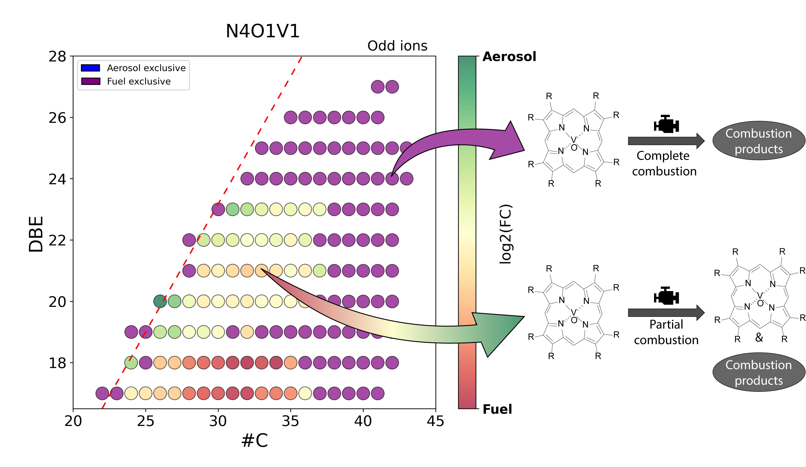

========
Compare
========

The  compare tab is provided with an inline merging function which does not create   a .csv file. Prior, the respective files have to be loaded into the data void of the
software accessible via a tabular section at the left center of the interface. The inline merge is performed automatically using the same principle as the previously mentioned
“Merge all species” “function”, while allowing a faster comparison   as the user only has to select files they want to compare among the loaded ones. Once this import and
preprocessing operation is completed, the user is able to plot several simple representations like the chemical class distribution or the DBE distribution shown before as
well as DBE vs #C maps and van Krevelen plots using a calculated fold change (FC) as color coding. Two analyses among the merged data can be selected to calculate fold
change values based on the intensity ratio of each peak between the two analyses.

    
    Exemplary utilization of DBE versus #C fingerprint diagram with color-coded fold change information for insights into the molecular
    fate of petroporphyrins through the combustion of bunker fuels in a ship diesel engine (feed fuel versus primary combustion aerosol).

According the petroinformatics principles nicely described by Hur et al., the binary logarithm of the FC (log2[FC]) can be used as the color coding variable
for easy graphical extraction of similarities and differences in the common chemical space based on expression/abundance. This kind of representation graphically
summarizes in which sample each molecular feature is given with a higher relative/absolute abundance and to which extent.
