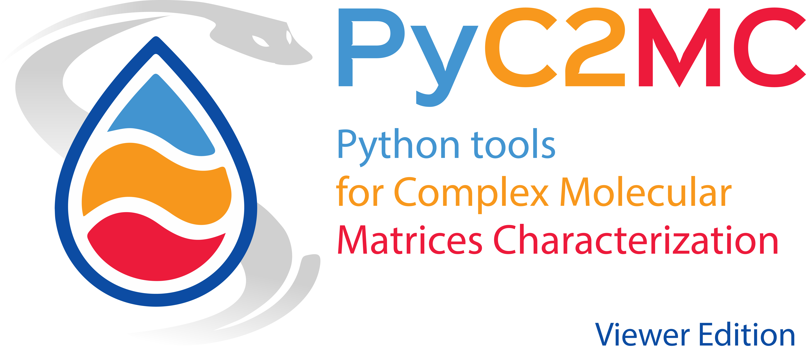

============
Introduction
============

    Python tools for complex matrices molecular characterization (Viewer edition).

    This package, called PyC2MC, has been in development since 2020 and is based on the commonly used Python
    language with the goal of being improvable even by people outside of the initial project. Indeed, the goal
    of this work is to provide a robust data visualization tool producing numerous plots as well as statistical
    analysis to ease the sample molecular fingerprinting and the inter-sample comparison. With the aim to deliver
    an easy-to-use application, we use a PyQT based graphical user interface designed under QtDesigner.
    Most of the application’s features are based on the molecular formulae attributed by either constructor or third-party software.

.. contents:: Table of contents

Licence and contact
===================

This software was developped at the `Université de Rouen Normandie <https://www.univ-rouen.fr/>`_
within the International Complex Matrices Molecular Characterization joint lab (`IC2MC <https://ic2mc.cnrs.fr/>`_)
which collaborators are :

- Analytical department team of Total Research and Technology Gonfreville. (`TotalEnergies <https://www.totalenergies.fr/>`_)
- Mass spectrometry group of COBRA laboratory. (`Université de Rouen Normandie <https://www.univ-rouen.fr/>`_)
- Analytical chemistry group of IPREM laboratory (`Université de Pau et des Pays de l'Adour <https://www.univ-pau.fr/fr/index.html>`_)
- FT-ICR research group of the National High Magnetic Field Laboratory (`NHMFL <https://nationalmaglab.org/>`_)

This software is distributed under the `MIT licence <https://opensource.org/licenses/MIT>`_.

**Authors**

* Maxime Sueur: `maxime.sueur1@univ-rouen.fr <maxime.sueur1@univ-rouen.fr>`_ [`ORCID <https://orcid.org/0000-0002-5014-0218>`_]
* Julien Maillard: `julien.maillard@univ-rouen.fr <julien.maillard@univ-rouen.fr>`_ [`ORCID <https://orcid.org/0000-0001-5620-8474>`_]
* Oscar Lacroix-Andrivet: `oscar.lacroix-andrivet@univ-rouen.fr  <oscar.lacroix-andrivet@univ-rouen.fr>`_ [`ORCID <https://orcid.org/0000-0002-6252-8244>`_]

.. image:: https://ic2mc.cnrs.fr/wp-content/uploads/2020/10/ic2mc-transp.png
    :target: https://ic2mc.cnrs.fr/
    :height: 150
    :align: center
