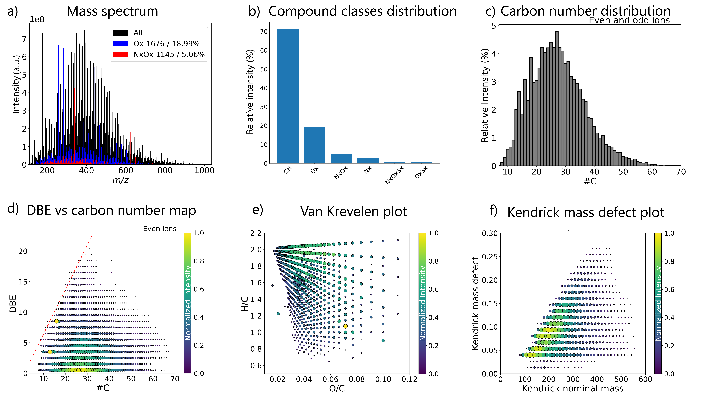

====
View
====

Molecular attribution lists from the analysis of complex mixtures are classically
visualized by basic finger-print plots, utilizing general parameters of the sum formulae,
such as carbon number (#C), unsaturation or double bond equivalents (DBE), or elemental
ratios (H/C, O/C). Selected examples of the basic representations are represented in
the folowing figure and found in the GUI under the “View” tab.

This tab encompasses all plots that
can be created using only one sample, or more in the case of a fused or merged input file.
PyC2MC allows to create data evaluation representations like error plots: error (in ppm)
between the theoretical m/z ratio calculated with the molecular formula and the observed
m/z ratio against the observed m/z ratio. Using the same information, two variants of the
error plot are feasible: the error distribution in a histogram and in a boxplot.
The application can also print the mass spectrum of a selected file and add a color
for the peaks belonging to a specific compound class as seen on figure a with the
peaks of the Ox and NxOy colored respectively in blue and red. For first insights into
the chemical composition and a rapid overview, this functionality can be very useful,
e.g., this can be used to demonstrate the predominance of a compound class of interest.
Another approach of data reduction is to visualize the compound class distribution bar
plot (summed relative/absolute abundance of all attributed signals belonging to the same
compound class) shown in figure b.  This kind of plot is also used to present the
distribution of other characteristic values such as the number of carbon atoms in the
molecular formulae (see figure c) or the double bond equivalent (DBE).
The application is also able to realize diagrams that are more specific to complex
matrices analysis as the DBE versus carbon number maps, with or without the planar
limit [44](red line), found on figure d . These classes of finger-print diagrams
allow to trace molecular building blocks and repetitive moieties easily, and, thus,
are very useful to highlight, e.g., alkylated series, and to have a molecular
fingerprint of the sample. The planar limit line can be utilized for planar limit-assisted
structural interpretation [44]. For these maps and the following diagrams, it is possible
for the user to apply a filter that only displays data relative to the compound class  of interest.
Another visualization approach directly utilizing the molecular formula attribution data
is the van Krevelen plot which consist in plotting the H/C ratio, or the ratio of an
heteroelement to carbon, against the ratio of another heteroelement to carbon.
Usually, the selected axis are H/C and O/C, giving a representation of the degree
of saturation versus structurally related relative content of oxidation of the compounds,
exemplarily given in figure e. However, it is also possible to plot a ratio against other
parameters, such as m/z. Finally, PyC2MC is able to print Kendrick mass defect plots  as
displayed in figure f,  based on the calculation of the Kendrick mass defect (KMD) with
equation :eq:`kmd1` :

.. math:: KMD = \text{Nominal Kendrick mass} - \text{Kendrick mass}
  :label: kmd1

With:

.. math:: \text{Kendrick mass} = \text{observed  mass} × {\frac {\text{Repetition pattern nominal mass}}{\text{Repetition pattern exact mass}}}
  :label: kmd2

And:

.. math:: \text{Kendrick nominal mass} = \text{rounded Kendrick mass}
  :label: kmd3

The Kendrick nominal mass can be obtained using two rounding methods: round to the closest integer
or round the Kendrick nominal mass to the upper integer (equivalent to round the nominal mass to the lower integer).
Both methods have their limits and are available within the software.
Kendrick’s diagram consists in plotting Kendrick nominal mass vs KMD, this representation allows
species differing only by n repetition pattern(s) to be displayed on the same horizontal line.
Historically and still most often used, the repetition pattern is CH2; in this case, KMD plots
highlight alkylated series, just as DBE versus carbon number maps. However, the repeating unit
can be changed to exhibit another interesting particularity of the sample, such as methoxy
moieties (CHO), oxidation (O), or any polymeric building units (e.g., polystyrene C8H8).
Contrary to most of the other visualization concepts, KMD plots do not require prior molecular
formula attribution and thus can be used with non-attributed peak lists.
